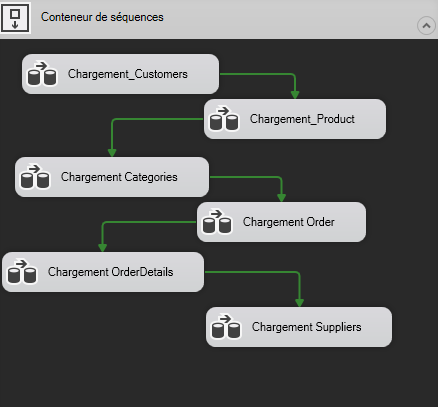
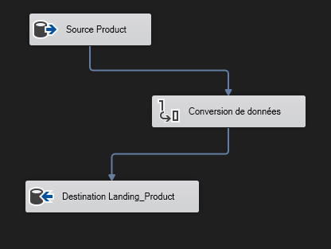
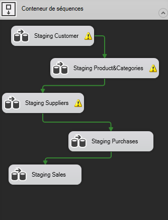
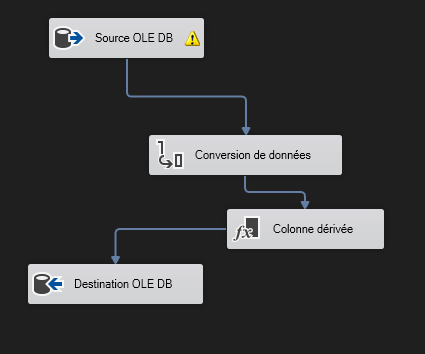
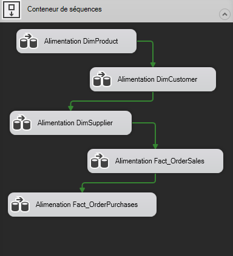
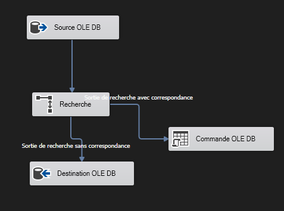
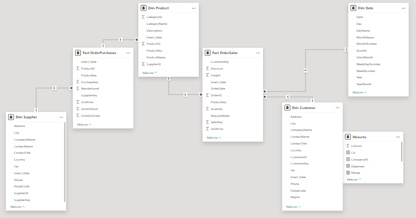
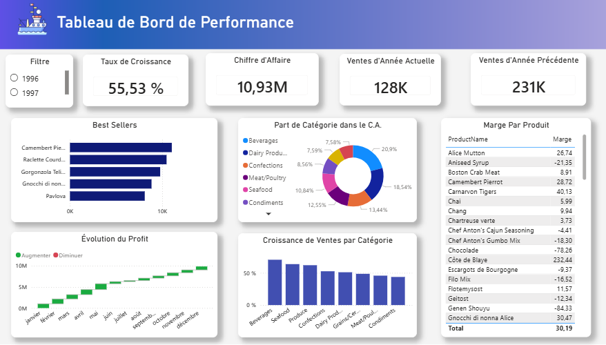

# Projet Data Warehouse Northwind

---

## Présentation du projet

Ce projet implémente un **pipeline Data Warehouse complet** depuis l'extraction des données de la base **Northwind** comme source OLTP brute jusqu'au reporting BI. L'objectif de ce projet est de transformer des données brutes en informations clés pour une prise de décision commerciale éclairée.

Le pipeline suit une architecture en 4 couches :

- **Northwind** comme source OLTP
- **ODS** pour le Landing et le Staging
- **DWH** pour stocker les tables de faits et les tables de dimensions
- **Dashboard Power BI** pour la visualisation et l'analyse

---

## Outils & Technologies

| Outil | Rôle |
|---|---|
| **SQL Server (SSMS)** | Création des bases, conception des schémas, scripts SQL |
| **SSIS (Visual Studio)** | Pipeline ETL — Landing, Staging, alimentation DWH |
| **Power BI Desktop** | Modélisation des données, mesures DAX, dashboard |

---

## Base source : Northwind

Northwind est une base **OLTP** entièrement normalisée représentant une entreprise qui achète des produits auprès de fournisseurs et les revend à des clients.

**Tables utilisées comme source :**

| Table | Description |
|---|---|
| `Customers` | Informations clients |
| `Orders` | En-têtes de commandes clients |
| `Order Details` | Lignes de commandes clients |
| `Products` | Catalogue produits |
| `Categories` | Catégories de produits |
| `Suppliers` | Informations fournisseurs |

---

## Architecture & Pipeline

### Couche 1 : Landing

La couche Landing est une **copie brute et non modifiée** des tables sources. La seule transformation effectuée est la conversion des données en `NVARCHAR` comme mesure préventive contre toute erreur d'alimentation.


**Package SSIS — `Landing.dtsx` :**

Toutes les tâches sont séquencées dans un **Conteneur de séquences** avec des Contraintes de précédence assurant une exécution ordonnée et contrôlée.




Chaque tâche de flux de données contient :
- **Source OLE DB** → table Northwind
- **Conversion de données** → standardisation des types
- **Destination OLE DB** → table Landing correspondante



---

### Couche 2 : Staging

La couche Staging **nettoie, transforme et joint** les données depuis les tables Landing. C'est ici que commence toute la logique métier.

**Règles appliquées :**
- Jointures entre tables Landing
- Conversion des types via la tâche **Conversion de données**
- Ajout de `Insert_Date = GETDATE()` via la tâche **Colonne dérivée** et correction des défauts détectés comme les valeurs nulles
- Une table Staging par destination finale (Dim ou Fact)

**Package SSIS — `Staging.dtsx` :**



Chaque tâche de flux de données contient :
- **Source OLE DB** → requête SQL avec JOINs depuis les tables Landing
- **Conversion de données** → types adéquats pour chaque colonne
- **Colonne dérivée** → ajout de `Insert_Date` et correction des problèmes détectés
- **Destination OLE DB** → table Staging correspondante
  


---

### Couche 3 : Data Warehouse

#### Tables de dimensions : SCD Type 1

Les dimensions sont chargées via la stratégie **Slowly Changing Dimension Type 1**. Les enregistrements existants sont mis à jour avec les nouvelles valeurs, et les nouveaux enregistrements sont insérés.

**Package SSIS — `Alimentation_DataWarehouse.dtsx` :**



Chaque tâche de flux de données contient :
- **Source OLE DB** → table Staging correspondante
- **Recherche** → vérification de la clé naturelle dans la table Dim
- **Sans correspondance** → insertion des données dans la table Dim (nouveau enregistrement)
- **Avec correspondance** → mise à jour des données existantes via une requête SQL dynamique (SCD Type 1)


---

#### Tables de faits : Chargement incrémental

Les nouvelles commandes sont détectées via une **Recherche** sur `OrderID`. Seules les lignes sans correspondance (nouvelles transactions) sont insérées. Les lignes existantes sont ignorées — une transaction passée ne se modifie jamais.

---

## Dashboard Power BI

### Modèle de données



Le modèle suit un **Galaxy Schema** (Fact Constellation), dont deux tables de faits sont reliées à des dimensions communes.
DimProduct est une **Conformed Dimension**. Elle est partagée entre les deux tables de faits, ce qui permet de croiser les analyses ventes et stock sur les mêmes produits.

---

### Création de la DimDate

La DimDate a été entièrement construite dans Power BI en DAX à partir de la requête suivante :

```dax
Dim Date = ADDCOLUMNS(
    CALENDAR(DATE(1996,1,1), DATE(1998,12,31)),
    "Year", YEAR([Date]),
    "MonthNumber", MONTH([Date]),
    "MonthName", FORMAT([Date], "MMMM"),
    "ShortMonth", FORMAT([Date], "MMM"),
    "Quarter", "Q" & FORMAT([Date], "Q"),
    "YearMonth", FORMAT([Date], "YYYY-MMM"),
    "Day", DAY([Date]),
    "DayName", FORMAT([Date], "DDDD"),
    "WeekDayNumber", WEEKDAY([Date], 2),
    "WeekNumber", WEEKNUM([Date], 2)
)
```

---

### Mesures DAX

```dax
-- Quantité totale vendue
Total_Ventes = SUM('Fact OrderSales'[Quantity])

-- Chiffre d'affaires
CA = SUMX('Fact OrderSales' , [Quantity]*[UnitPrice]+[Freight])

-- Dépenses
Depenses = SUMX('Fact OrderPurchases', ([UnitsOnOrder] + [UnitsInStock]) * [UnitPrice])

-- Profit
Profit = [CA] - [Depenses]

-- Marge
Marge = DIVIDE([Profit] , [Total_Ventes],0)

-- Taux de croissance annuel
Croissance% = DIVIDE([Total_Ventes] - [Quantite_Last_YtD], [Quantite_Last_YtD], 0)

-- Quantité cumulée
Quantite_YTD = TOTALYTD([Total_Ventes], 'Dim Date'[Date])

-- Quantité année précédente
Quantite_Last_YtD = CALCULATE([Total_Ventes], SAMEPERIODLASTYEAR('Dim Date'[Date]))
```

---

**Questions métier à répondre par visualisations**
- Quel est le chiffre d'affaires total généré ? 
- L'activité est-elle en croissance par rapport à l'année précédente ? 
- Combien d'unités ont été vendues cette année ? 
- Quels produits génèrent le plus de ventes ?
- Quelle catégorie de produits contribue le plus au chiffre d'affaires ?
- Quels mois ont été rentables ou déficitaires ?
- Quelles catégories connaissent la plus forte croissance ?
---

### Vue Générale du Tableau de Bord


